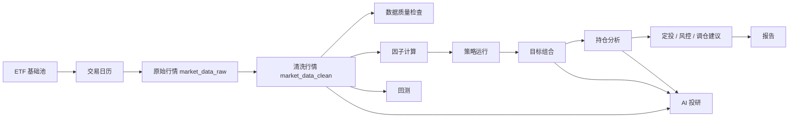
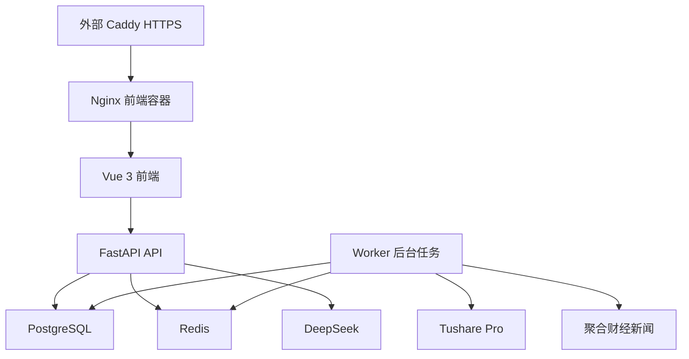

# ETF Systematic Portfolio Platform

面向个人 ETF 投研和资产配置的全栈量化平台。系统覆盖 ETF 数据同步、行情清洗、因子计算、策略轮动、组合生成、持仓分析、定投计划、风控调仓、回测复盘、报告生成、AI 投研、多用户权限和生产部署。

> 本项目是投研和决策辅助系统，不连接真实券商账户，不自动下单，不直接操作资金。所有买入、卖出、调仓和定投建议都需要人工确认。

## 项目亮点

- **完整投研闭环**：从 ETF 池、行情、清洗、质量检查、因子、策略、组合、持仓、定投、风控、回测到报告，形成可复用流程。
- **工程化数据链路**：外部行情先进入 `market_data_raw`，再清洗到 `market_data_clean`，策略、因子和回测统一读取清洗后数据。
- **后台任务体系**：使用 Redis 和独立 worker 执行全流程任务、历史初始化、行情补齐和每日维护，避免长任务阻塞 API。
- **量化策略能力**：支持趋势、动量、波动、回撤、流动性、Alpha 等因子计算，并通过 ETF 轮动策略生成目标组合。
- **风控和回测闭环**：支持目标组合风险检查、调仓建议单、买入持有/月度轮动/月度追加资金回测、交易记录和指标落库。
- **AI 投研辅助**：接入 DeepSeek，根据本地行情、因子、持仓、目标组合、新闻和报告上下文生成中文投研总结。
- **多用户和安全**：支持 `admin`、`researcher`、`viewer` 三类角色，具备登录认证、操作审计、敏感参数脱敏和部分业务数据隔离。
- **生产部署可落地**：Docker Compose 编排 PostgreSQL、Redis、API、worker 和前端容器，外部 Caddy 提供 HTTPS 反向代理。

## 在线地址

- Web 控制台：`https://etf.8886767.xyz`
- AI 投研页面：`https://etf.8886767.xyz/agent-analysis`
- 健康检查：`https://etf.8886767.xyz/health/ready`

生产环境已开启登录保护。面试展示时建议使用只读或演示账号，不要展示真实 Token、数据库密码或个人持仓隐私。

## 技术栈

| 层级 | 技术 |
| --- | --- |
| 后端 | Python 3.11, FastAPI, Pydantic, SQLAlchemy 2.x, Alembic |
| 数据库 | PostgreSQL |
| 缓存/任务 | Redis, worker, APScheduler |
| 数据处理 | pandas, numpy, requests |
| 前端 | Vue 3, TypeScript, Vite, Element Plus, ECharts, Axios |
| AI | DeepSeek OpenAI-compatible API |
| 数据源 | Tushare Pro, 聚合数据财经新闻 |
| 部署 | Docker Compose, Nginx, Caddy, GitHub pull deploy |

## 系统流程



## 核心功能

### 数据与行情

- ETF 基础池、研究池和主资料管理。
- Tushare 交易日历、ETF 日线行情、ETF 档案、基金净值、基金份额和指数行情同步。
- 原始行情和清洗行情分层落库。
- 数据质量检查、缺失样本统计、行情补齐计划和后台补齐任务。
- 聚合数据财经新闻同步和本地新闻列表。

### 量化投研

- 因子计算：趋势、动量、波动、回撤、流动性、Alpha。
- ETF 筛选、ETF 对比、ETF 详情和同指数替代观察。
- 参数化策略管理，当前核心策略为 `core_etf_rotation`。
- 目标组合生成，策略运行结果可追溯到 `run_id`、策略代码、版本和运行日期。

### 组合、风控和回测

- 当前持仓手动录入，自动补全 ETF 名称、类型、现价、市值、权重和浮盈亏。
- 持仓分析：对比目标组合，给出加仓、减仓、持有或退出建议。
- 定投计划：基于预算、周期和目标参数生成每期建议。
- 风控检查：输出风险结果和调仓建议单，不自动交易。
- 回测：支持买入持有、月度轮动、月度追加资金、交易成本、净值曲线、交易记录和绩效指标。

### AI 投研

- DeepSeek 用于中文总结和表达增强。
- AI 结论基于本地行情、因子、持仓、目标组合、新闻和报告上下文。
- AI 不编造行情、收益、费率或规模，不直接生成交易指令。
- AI 投研历史写入数据库，并按当前登录用户隔离。

### 权限、审计和运维

- 登录认证，生产环境除 `/health` 和 `/api/auth/*` 外默认需要登录。
- 数据库用户和环境变量兜底管理员双登录来源。
- 角色：`admin`、`researcher`、`viewer`。
- 变更类 API 写入操作审计，审计日志不保存请求正文，敏感 query 参数脱敏。
- 系统状态页展示健康检查、任务中心、数据质量、每日维护状态。
- 生产部署脚本支持自动拉取、备份、Compose 校验、镜像构建、容器启动和 ready 检查。

## 架构说明



生产环境使用 Docker Compose 管理：

- `api`：FastAPI 服务，容器启动时执行 Alembic migration。
- `worker`：执行后台任务、每日维护和任务中心队列。
- `frontend`：Nginx 托管 Vue 构建产物，只绑定服务器本机端口。
- `postgres`：业务数据库。
- `redis`：任务状态、worker 心跳和锁。

## 目录结构

```text
backend/
  app/api/          FastAPI 路由
  app/services/     业务逻辑、数据源、策略、风控、回测、AI
  app/models/       SQLAlchemy ORM
  app/schemas/      Pydantic 请求和响应模型
  app/core/         配置、数据库、日志、安全、调度
  alembic/          数据库迁移
  tests/            后端测试

frontend/
  src/views/        业务页面
  src/api/          API client 和前端类型
  src/router/       路由
  src/App.vue       主布局

docs/               架构、数据库、API、策略、风控、回测、部署和开发日志
scripts/            部署、备份、恢复、数据同步脚本
sql/                新 volume 初始化 SQL
```

## 本地启动

```bash
cp .env.example .env
docker compose up --build
```

本地地址：

- 前端：`http://localhost:5173`
- 后端：`http://localhost:8000`
- Swagger：`http://localhost:8000/docs`

## 常用验证

```bash
docker compose config -q
docker compose build api
docker compose run --rm api pytest -q
cd frontend
npm run build
```

如果本地 Python 依赖齐全，也可以运行：

```bash
python -m compileall -q backend/app
python -m pytest backend/tests -q
```

## 生产部署

服务器目录：

```bash
/opt/ETFSystematicPortfolioPlatform
```

部署命令：

```bash
cd /opt/ETFSystematicPortfolioPlatform
git pull --ff-only
python3 scripts/deploy_production.py --compose-file compose.production.external-caddy.yml --env-file .env.production
```

部署脚本会执行：

1. 拉取 GitHub 最新代码。
2. 备份 PostgreSQL。
3. 校验 Docker Compose 配置。
4. 构建并启动容器。
5. 执行 Alembic 迁移。
6. 检查 API ready。

## 面试展示要点

可以把本项目概括为：

> 独立设计并实现 ETF 系统化资产配置平台，基于 FastAPI、Vue 3、PostgreSQL、Redis 和 Docker Compose 构建全栈量化投研系统，支持 ETF 数据同步清洗、因子计算、策略轮动、组合生成、持仓分析、定投建议、风控调仓、回测复盘、AI 投研报告、多用户权限和生产部署。

适合在简历中强调：

- **全栈能力**：从数据库、后端 API、前端页面到生产部署都独立完成。
- **数据工程能力**：外部数据接入、raw/clean 分层、数据质量检查、缺失补齐和后台任务。
- **量化业务理解**：因子、策略、组合、风控、回测、交易成本和收益风险指标。
- **工程稳定性**：Alembic migration、审计日志、权限控制、worker、健康检查和自动部署。
- **AI 应用落地**：DeepSeek 不是聊天入口，而是基于本地投研上下文生成可追溯报告。

更完整的面试讲解口径见：[docs/17_面试项目说明.md](docs/17_面试项目说明.md)。

## 文档入口

- [文档导航](docs/00_文档导航.md)
- [项目说明](docs/01_项目说明.md)
- [系统架构](docs/02_系统架构.md)
- [数据库设计](docs/03_数据库设计.md)
- [API 接口文档](docs/04_API接口文档.md)
- [策略设计](docs/05_策略设计.md)
- [风控设计](docs/06_风控设计.md)
- [回测设计](docs/07_回测设计.md)
- [部署说明](docs/08_部署说明.md)
- [开发日志](docs/09_开发日志.md)
- [面试项目说明](docs/17_面试项目说明.md)

## 安全和投资边界

- 本项目不是投资顾问服务。
- 系统输出不构成收益承诺。
- 当前不接入真实券商账户。
- 当前不自动下单，不直接操作资金。
- 所有买卖、调仓和定投建议都需要人工确认。
- API Key、数据库密码、登录密码只能保存在 `.env` 或服务器 `.env.production`，不能提交到 Git。
